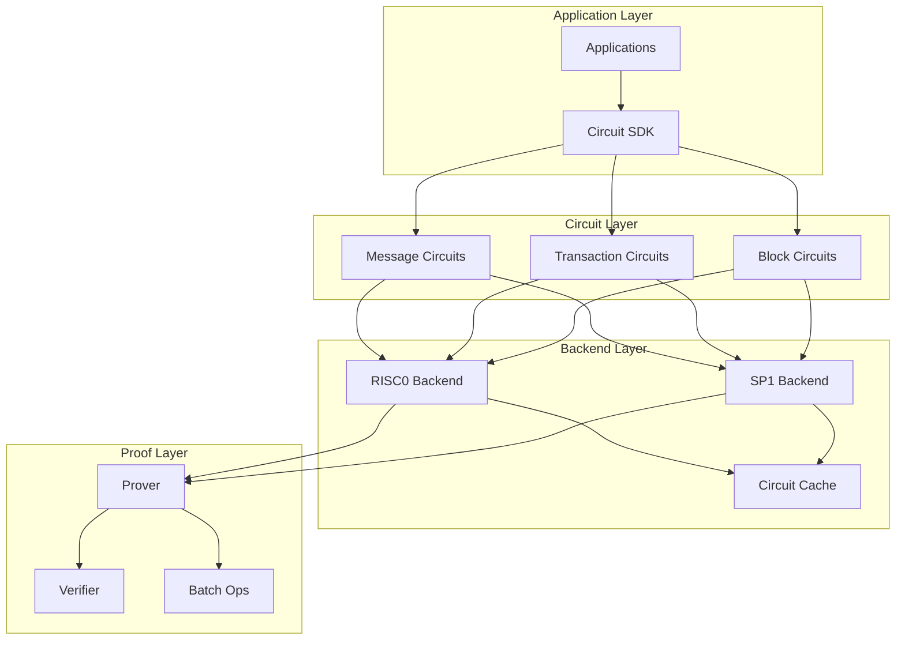
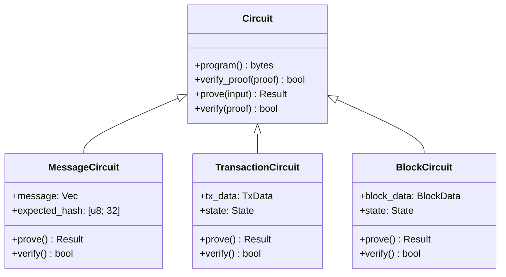
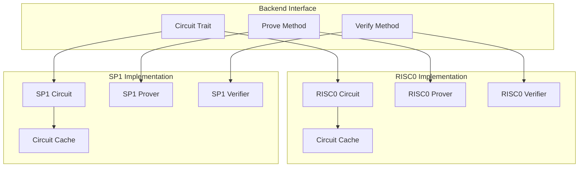
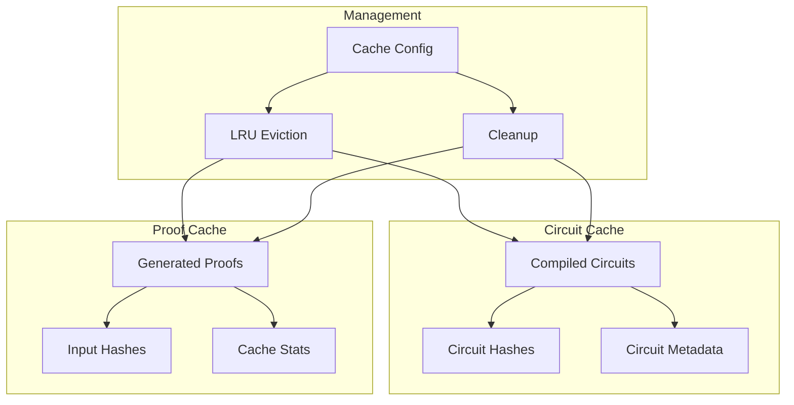
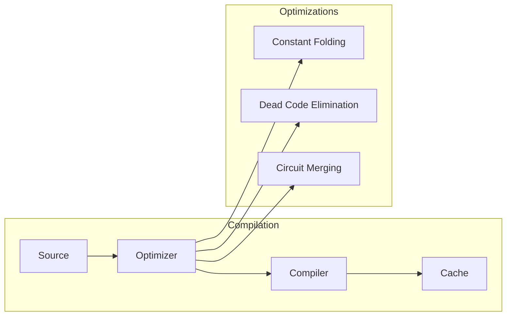
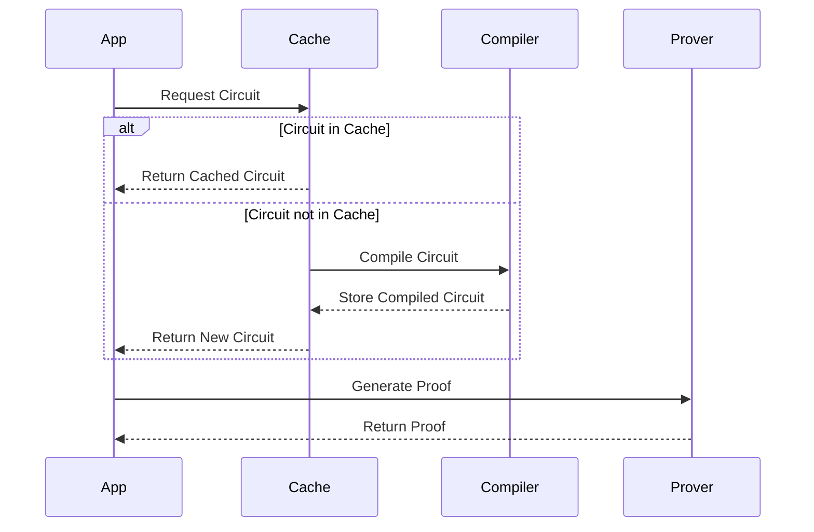
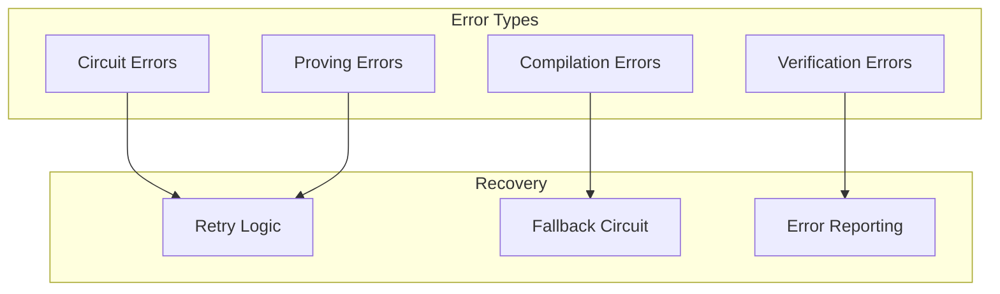
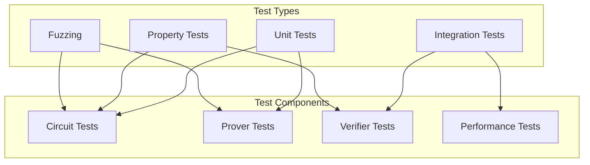

# Frostgate Circuits Design

This document describes the current design of Frostgate's zero-knowledge circuit system.

## Architecture Overview



## Core Components

### 1. Circuit Types



### 2. Backend Integration



## Circuit Implementations

### 1. Message Verification Circuit

```rust
pub struct MessageVerifyCircuit {
    message: Vec<u8>,
    expected_hash: [u8; 32],
    circuit_bytes: Vec<u8>,
}

impl Circuit for MessageVerifyCircuit {
    fn program(&self) -> &[u8] {
        &self.circuit_bytes
    }

    fn verify_proof(&self, proof: &[u8]) -> bool {
        // Verify hash matches
        let actual_hash = hash_message(&self.message);
        actual_hash == self.expected_hash && 
        self.verify_proof_internal(proof)
    }
}
```

### 2. Transaction Verification Circuit

```rust
pub struct TxVerifyCircuit {
    tx_data: TxData,
    state: State,
    circuit_bytes: Vec<u8>,
}

impl Circuit for TxVerifyCircuit {
    fn program(&self) -> &[u8] {
        &self.circuit_bytes
    }

    fn verify_proof(&self, proof: &[u8]) -> bool {
        // Verify transaction validity
        self.verify_tx_validity() &&
        // Verify state transition
        self.verify_state_transition() &&
        // Verify proof
        self.verify_proof_internal(proof)
    }
}
```

## Caching System



## Performance Optimizations

### 1. Circuit Compilation



### 2. Proof Generation



## Error Handling



## Testing Framework



## Future Extensions

1. Circuit Optimizations
   - Advanced circuit merging
   - Automated optimization
   - Custom constraint systems

2. Backend Support
   - Additional ZK backends
   - Custom proving systems
   - Hybrid approaches

3. Performance Features
   - Parallel proof generation
   - Circuit preprocessing
   - Hardware acceleration

4. Testing Features
   - Automated circuit testing
   - Property-based testing
   - Benchmark framework 