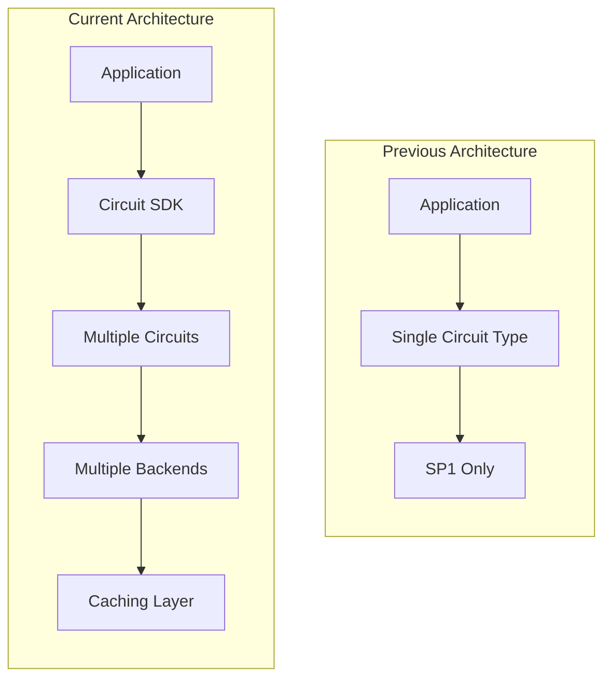
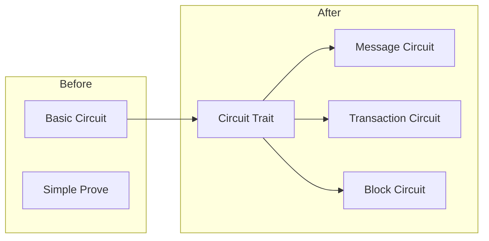
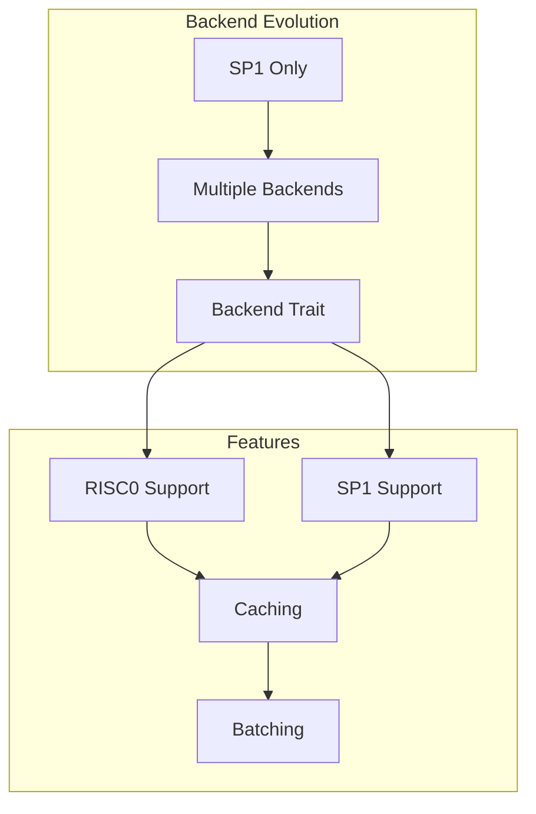
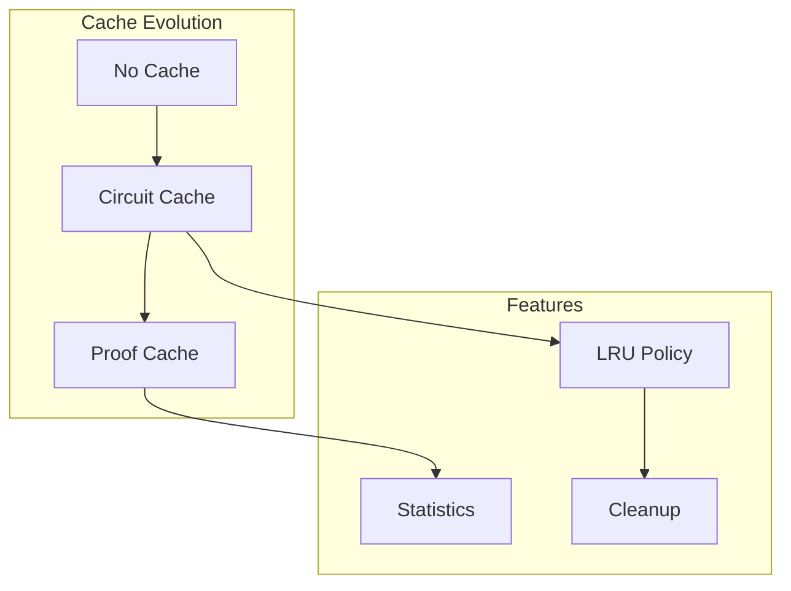
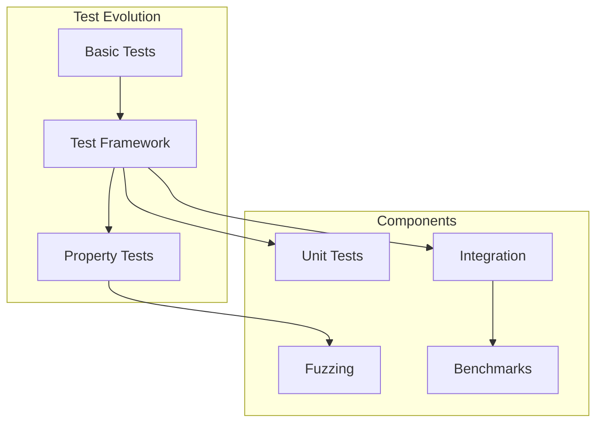
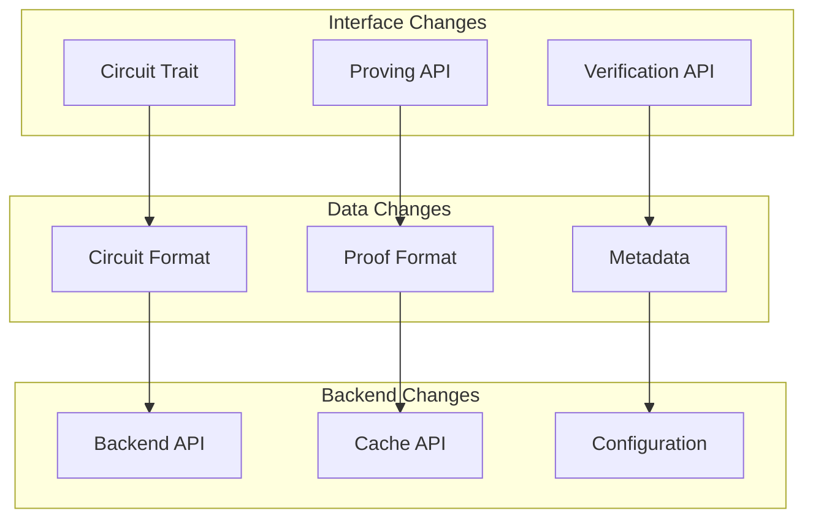
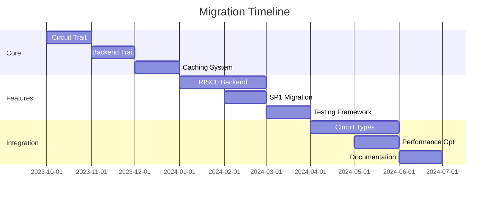

# Frostgate Circuits Migration Guide

This document outlines the migration path from the previous circuit architecture to the current design, highlighting key changes and improvements.

## Architecture Evolution



## Previous Architecture Limitations

1. Limited Circuit Types
   - Only message verification
   - No transaction support
   - No block verification

2. Single Backend
   - SP1-only implementation
   - No backend abstraction
   - Limited proving options

3. Performance Issues
   - No circuit caching
   - Sequential proof generation
   - Limited optimization

4. Development Constraints
   - No testing framework
   - Limited debugging tools
   - Poor error handling

## Migration Steps

### 1. Circuit Trait Redesign



#### Before:
```rust
struct Circuit {
    message: Vec<u8>,
    hash: [u8; 32],
}

impl Circuit {
    fn prove(&self) -> Vec<u8> {
        // Basic proving logic
    }
}
```

#### After:
```rust
trait Circuit {
    fn program(&self) -> &[u8];
    fn verify_proof(&self, proof: &[u8]) -> bool;
    fn prove(&self, input: &[u8]) -> Result<Vec<u8>>;
    fn verify(&self, proof: &[u8]) -> bool;
}

struct MessageCircuit { /* ... */ }
struct TransactionCircuit { /* ... */ }
struct BlockCircuit { /* ... */ }
```

### 2. Backend Integration



### 3. Caching Implementation



### 4. Testing Framework



## Breaking Changes



## Migration Benefits

1. Enhanced Functionality
   - Multiple circuit types
   - Rich proving options
   - Advanced verification

2. Improved Performance
   - Circuit caching
   - Proof caching
   - Parallel execution

3. Better Development
   - Comprehensive testing
   - Better error handling
   - Debugging tools

4. Future-Proofing
   - Backend abstraction
   - Extensible design
   - Upgrade path

## Migration Timeline



## Migration Steps

1. Preparation
   - Audit existing circuits
   - Plan backend support
   - Update dependencies

2. Core Updates
   - Implement circuit trait
   - Add backend abstraction
   - Setup caching

3. Feature Migration
   - Add circuit types
   - Implement backends
   - Add testing

4. Integration
   - Update applications
   - Migrate circuits
   - Update documentation

## Backward Compatibility

1. Compatibility Layer
   - Legacy circuit support
   - Format conversion
   - API compatibility

2. Migration Tools
   - Circuit converter
   - Proof converter
   - Verification tools

## Testing Strategy

1. Unit Tests
   - Circuit implementations
   - Backend integration
   - Cache operations

2. Integration Tests
   - End-to-end proving
   - Cross-backend verification
   - Performance testing

3. Migration Tests
   - Format conversion
   - API compatibility
   - Performance comparison 